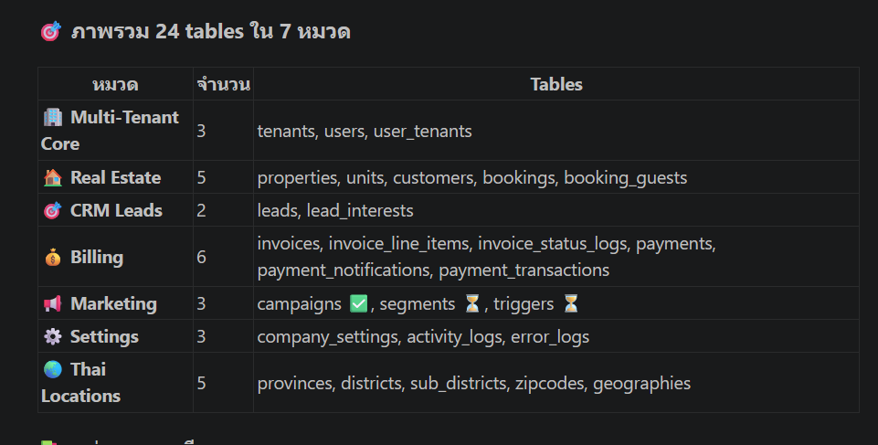

# 🗄️ CHATEAU Platform — Database Structure Overview

> ภาพรวมตารางทั้งหมดในฐานข้อมูล Supabase ของ CHATEAU
>
> **อัปเดต:** 2026-04-24
> **จำนวน Migrations:** 94 ไฟล์
> **จำนวน Tables:** 24 unique tables (7 หมวดหลัก)

---

## 📊 ภาพรวม

```
PLATFORM CORE     (3 tables)  ────  ระบบ multi-tenant
REAL ESTATE       (5 tables)  ────  property + sales
CRM              (2 tables)  ────  leads management
BILLING          (6 tables)  ────  invoices + payments
MARKETING        (3 tables)  ────  campaigns + segments + triggers
SETTINGS         (3 tables)  ────  ตั้งค่า + logs
THAI LOCATIONS   (5 tables)  ────  reference data ที่อยู่ไทย
```

---

# 🏢 1. Multi-Tenant Core (3 tables)

ระบบหลักที่รองรับหลายบริษัทใช้ระบบเดียว — แต่ละ tenant แยกข้อมูลกันสนิท (RLS)

## `tenants` — บริษัทที่ใช้ระบบ
```sql
id              UUID PRIMARY KEY
name            TEXT             -- ชื่อบริษัท
slug            CITEXT UNIQUE    -- URL slug
domain          CITEXT UNIQUE    -- custom domain
status          TEXT             -- trial/active/suspended/cancelled
subscription_plan TEXT           -- free/starter/professional/enterprise
max_properties  INT              -- จำนวนโครงการสูงสุด
settings        JSONB
created_at      TIMESTAMPTZ
```

**ใช้ที่ไหน:** ทุกที่ — เป็นรากของ multi-tenancy

---

## `users` — ผู้ใช้ทั้งหมด
```sql
id                UUID PRIMARY KEY (= auth.uid)
email             TEXT UNIQUE
full_name         TEXT
avatar_url        TEXT
phone             TEXT
tenant_id         UUID → tenants  -- อยู่บริษัทไหน
role              TEXT             -- owner/admin/sales
is_active         BOOLEAN
last_sign_in_at   TIMESTAMPTZ
created_at        TIMESTAMPTZ
```

**ใช้ที่ไหน:** Authentication, RBAC, audit

---

## `user_tenants` — Many-to-Many (user อยู่หลายบริษัท)
```sql
user_id    UUID → users
tenant_id  UUID → tenants
role       TEXT
```

**ใช้ที่ไหน:** Switch tenant, multi-org support

---

# 🏠 2. Real Estate (5 tables)

ระบบจัดการโครงการ + ห้อง + การจอง

## `properties` — โครงการอสังหา
```sql
id              UUID PRIMARY KEY
tenant_id       UUID → tenants
name            TEXT             -- "BAAN ISSARA Phase 2"
type            ENUM             -- apartment/house/villa/condo/commercial
description     TEXT
address         JSONB            -- {province, district, sub_district, zipcode}
amenities       JSONB
base_price      DECIMAL
currency        CHAR(3)          -- THB/USD
max_guests      INT
bedrooms        INT
bathrooms       INT
size_sqft       INT
images          JSONB            -- array of URLs
is_active       BOOLEAN
created_at      TIMESTAMPTZ
```

**ใช้ที่ไหน:** Property listing, campaign linkage

---

## `units` — ห้อง/หน่วยใน property
```sql
id              UUID PRIMARY KEY
property_id     UUID → properties
unit_number     TEXT             -- "A-101"
floor           INT
unit_type       TEXT             -- studio/1bed/2bed/penthouse
size_sqm        DECIMAL
price           DECIMAL
status          TEXT             -- available/reserved/sold
images          JSONB
```

**ใช้ที่ไหน:** Floor plan, availability matrix

---

## `customers` — ลูกค้า
```sql
id              UUID PRIMARY KEY
tenant_id       UUID → tenants
email           TEXT
full_name       TEXT
phone           TEXT
date_of_birth   DATE             -- ใช้ทำ birthday trigger
nationality     TEXT
id_document     JSONB            -- เลข ID/Passport
preferences     JSONB            -- ← ใช้ filter segment ได้
is_active       BOOLEAN
created_at      TIMESTAMPTZ
```

**ใช้ที่ไหน:** ลูกค้าจริง (ผ่าน lead → customer conversion)

---

## `bookings` — การจอง
```sql
id                  UUID PRIMARY KEY
tenant_id           UUID → tenants
property_id         UUID → properties
customer_id         UUID → customers
check_in_date       DATE
check_out_date      DATE
guests              INT
total_amount        DECIMAL
status              ENUM             -- pending/confirmed/checked_in/checked_out/cancelled
special_requests    TEXT
notes               JSONB
created_by          UUID → users
created_at          TIMESTAMPTZ
```

**ใช้ที่ไหน:** Booking flow, revenue tracking

---

## `booking_guests` — ผู้พักร่วมในการจอง
```sql
id              UUID PRIMARY KEY
booking_id      UUID → bookings
guest_name      TEXT
guest_id_doc    JSONB
```

**ใช้ที่ไหน:** Track ทุกคนในการจอง

---

# 🎯 3. CRM — Leads (2 tables)

## `leads` — ลูกค้าเป้าหมาย
```sql
id                    UUID PRIMARY KEY
tenant_id             UUID → tenants
customer_id           UUID → customers (nullable)
property_id           UUID → properties (สนใจโครงการไหน)
unit_id               UUID → units
status                ENUM         -- new/contacted/qualified/negotiating/won/lost
source                TEXT          -- facebook/google/walk-in/referral
assigned_to           UUID → users  -- sales ที่ดูแล
notes                 TEXT
priority              TEXT          -- low/medium/high
estimated_value       DECIMAL
expected_close_date   DATE
last_contact_date     TIMESTAMPTZ   -- ใช้ทำ inactive trigger
next_follow_up        DATE
metadata              JSONB
created_at            TIMESTAMPTZ
```

**ใช้ที่ไหน:** Lead pipeline, sales tracking

---

## `lead_interests` — ห้อง/Property ที่ Lead สนใจ
```sql
id              UUID PRIMARY KEY
lead_id         UUID → leads
property_id     UUID → properties
unit_id         UUID → units
purpose         TEXT             -- "อยู่อาศัย"/"ลงทุน"/"เก็งกำไร"/"ปล่อยเช่า"
budget_range    JSONB
notes           TEXT
created_at      TIMESTAMPTZ
```

**ใช้ที่ไหน:** Lead-Property matching, recommendation

---

# 💰 4. Billing & Payments (6 tables)

## `invoices` — ใบแจ้งหนี้
```sql
id              UUID PRIMARY KEY
tenant_id       UUID → tenants
invoice_number  TEXT UNIQUE
amount          DECIMAL
status          TEXT             -- draft/sent/paid/overdue/cancelled
issued_at       TIMESTAMPTZ
due_date        DATE
paid_at         TIMESTAMPTZ
notes           TEXT
```

---

## `invoice_line_items` — รายการใน invoice
```sql
id              UUID PRIMARY KEY
invoice_id      UUID → invoices
description     TEXT
quantity        INT
unit_price      DECIMAL
total           DECIMAL
```

---

## `invoice_status_logs` — ประวัติเปลี่ยน status
```sql
id              UUID PRIMARY KEY
invoice_id      UUID → invoices
status          TEXT
changed_by      UUID → users
comment         TEXT
created_at      TIMESTAMPTZ
```

---

## `payments` — การชำระเงิน
```sql
id              UUID PRIMARY KEY
invoice_id      UUID → invoices
amount          DECIMAL
payment_method  TEXT             -- bank_transfer/credit_card/promptpay
reference       TEXT
paid_at         TIMESTAMPTZ
verified_by     UUID → users
```

---

## `payment_notifications` — แจ้งเตือนการชำระ
```sql
id              UUID PRIMARY KEY
invoice_id      UUID → invoices
status          TEXT
channel         TEXT             -- email/line/sms
sent_at         TIMESTAMPTZ
```

---

## `public.payment_transactions` — Transaction log จาก gateway
```sql
id              UUID PRIMARY KEY
gateway         TEXT             -- stripe/omise/2c2p
transaction_id  TEXT
amount          DECIMAL
status          TEXT
raw_response    JSONB
```

---

# 📢 5. Marketing (3 tables)

## `campaigns` — Marketing campaigns ✅
```sql
id                  UUID PRIMARY KEY
tenant_id           UUID → tenants
campaign_code       VARCHAR(50)      -- "CMP-001"
campaign_name       VARCHAR(255)
campaign_url        TEXT
image_url           TEXT
detail              TEXT
start_date          DATE
end_date            DATE
frequency           VARCHAR          -- daily/weekly/monthly
segments            TEXT[]           -- ['income_high', 'family']
activities          TEXT[]
status              VARCHAR          -- draft/active/paused/completed
recipients_count    INT
impressions_count   INT
clicks_count        INT
ctr                 DECIMAL(5,2)

-- ที่จะเพิ่ม (รอ apply migration):
property_id         UUID → properties
campaign_type       VARCHAR          -- launch/open_house/news/etc.
cta_text            VARCHAR(100)
cta_url             TEXT
template            VARCHAR(50)
headline            TEXT
message_body        TEXT
attachment_urls     JSONB
schedule_type       VARCHAR
scheduled_at        TIMESTAMPTZ
approval_status     VARCHAR
approver_id         UUID → users
approved_at         TIMESTAMPTZ
utm_params          JSONB
```

---

## `segments` — กลุ่มเป้าหมาย ⏳ (รอ apply)
```sql
id              UUID PRIMARY KEY
tenant_id       UUID → tenants
code            VARCHAR(50)      -- "income_high"
name            VARCHAR(255)     -- "รายได้สูง"
description     TEXT
filter_rules    JSONB            -- {"income_min": 100000}
member_count    INT              -- cached
is_active       BOOLEAN
```

**ใช้ที่ไหน:** Builder Wizard Step 1, campaign targeting

---

## `triggers` — Automation rules ⏳ (รอ apply)
```sql
id              UUID PRIMARY KEY
tenant_id       UUID → tenants
name            VARCHAR(255)
event_type      VARCHAR(100)     -- lead.created/customer.birthday
action_type     VARCHAR(100)     -- send_line_message
action_config   JSONB
conditions      JSONB
is_active       BOOLEAN
fired_count     INT
last_fired_at   TIMESTAMPTZ
```

**ใช้ที่ไหน:** Marketing automation

---

# ⚙️ 6. Settings & System (3 tables)

## `company_settings` — ตั้งค่าต่อบริษัท
```sql
id                  UUID PRIMARY KEY
tenant_id           UUID → tenants
logo_url            TEXT
brand_colors        JSONB
billing_settings    JSONB
notification_prefs  JSONB
```

---

## `public.activity_logs` — Audit trail
```sql
id              UUID PRIMARY KEY
user_id         UUID → users
tenant_id       UUID → tenants
action          TEXT             -- created/updated/deleted
entity_type     TEXT             -- campaign/lead/property
entity_id       UUID
metadata        JSONB
created_at      TIMESTAMPTZ
```

---

## `public.error_logs` — Error monitoring
```sql
id              UUID PRIMARY KEY
error_type      TEXT
message         TEXT
stack           TEXT
user_id         UUID → users
url             TEXT
user_agent      TEXT
created_at      TIMESTAMPTZ
```

---

# 🌏 7. Thailand Locations (5 tables — Reference Data)

ข้อมูลที่อยู่ไทยที่ใช้ใน address forms

## `th_geographies` — ภาคต่างๆ
```sql
id              SERIAL PRIMARY KEY
name            TEXT             -- "ภาคเหนือ"/"ภาคอีสาน"/etc.
```
**จำนวน:** ~6 ภาค

---

## `th_provinces` — จังหวัด
```sql
id              SERIAL PRIMARY KEY
geography_id    INT → th_geographies
name_th         TEXT             -- "เชียงใหม่"
name_en         TEXT             -- "Chiang Mai"
```
**จำนวน:** 77 จังหวัด

---

## `th_districts` — อำเภอ
```sql
id              SERIAL PRIMARY KEY
province_id     INT → th_provinces
name_th         TEXT
name_en         TEXT
```
**จำนวน:** ~928 อำเภอ

---

## `th_sub_districts` — ตำบล
```sql
id              SERIAL PRIMARY KEY
district_id     INT → th_districts
name_th         TEXT
name_en         TEXT
```
**จำนวน:** ~7,255 ตำบล

---

## `th_zipcodes` — รหัสไปรษณีย์
```sql
id                  SERIAL PRIMARY KEY
sub_district_id     INT → th_sub_districts
zipcode             TEXT
```
**จำนวน:** ~7,000+ รหัส

**ใช้ที่ไหน:** Address autocomplete ใน property/customer forms

---

# 🔗 ER Diagram (ภาพรวม)

```
                ┌──────────┐
                │ tenants  │
                └────┬─────┘
       ┌─────────────┼─────────────┐
       ↓             ↓             ↓
   users ←── user_tenants    company_settings

   tenant_id (ใช้ทุก tenant-scoped table)
       │
       ├── properties ──→ units
       │       ↓
       │   bookings ──→ booking_guests
       │       ↑
       ├── customers ←──┘
       │
       ├── leads ──→ lead_interests ──→ properties
       │       ↑
       │     users (assigned_to)
       │
       ├── invoices ──→ invoice_line_items
       │       ├──→ invoice_status_logs
       │       └──→ payments ──→ payment_notifications
       │
       ├── campaigns ──→ properties (เพิ่มแล้ว — รอ apply)
       ├── segments  (รอ apply)
       └── triggers  (รอ apply)
```

---

# 🎯 ที่ใช้ทำ Segment ได้ (ข้อมูลที่มีอยู่แล้ว)

แม้ตอนนี้ยังไม่มี `segments` table แยก — แต่ข้อมูลที่ใช้ filter ได้กระจายอยู่ใน 4 tables:

## จาก `customers`
```sql
preferences JSONB         -- เก็บ filter ได้ทุกอย่าง
date_of_birth DATE        -- คำนวณอายุ → age segment
nationality TEXT          -- Thai/Foreigner segment
created_at TIMESTAMPTZ    -- New customer / Loyal customer
```

## จาก `leads`
```sql
status VARCHAR            -- new/contacted/qualified/won/lost (= activity segment)
source VARCHAR            -- facebook/google/walk-in (= source segment)
priority VARCHAR          -- high/medium/low
estimated_value DECIMAL   -- ระดับงบ → budget segment
last_contact_date         -- inactive 7d/30d → re-engagement segment
metadata JSONB            -- custom data
```

## จาก `lead_interests`
```sql
purpose TEXT              -- อยู่อาศัย/ลงทุน/เก็งกำไร (= buyer_type segment)
property_id UUID          -- สนใจโครงการ A/B/C (= property segment)
```

## จาก `bookings`
```sql
total_amount DECIMAL      -- ระดับใช้จ่าย → spending tier
status                    -- repeat customer
```

---

# 📋 สถานะตารางตอนนี้

| ✅ มีใน DB จริงแล้ว (Apply แล้ว) | ⏳ รอ Apply Migration |
|---|---|
| tenants, users, user_tenants | segments |
| properties, units, customers, bookings, booking_guests | triggers |
| leads, lead_interests | (campaigns ปกติมีอยู่ แต่ extend columns รอ) |
| invoices, invoice_line_items, invoice_status_logs | |
| payments, payment_notifications, payment_transactions | |
| campaigns (ของเดิม), company_settings | |
| activity_logs, error_logs | |
| th_provinces, th_districts, th_sub_districts, th_zipcodes, th_geographies | |

---

# 🚀 Migration Files ที่รอ Apply

| ไฟล์ | สถานะ | เพิ่มอะไร |
|---|---|---|
| `20260424000002_create_marketing_tables.sql` | ⏳ รอ apply | 2 tables (segments, triggers) + extend campaigns |
| `20260424000003_seed_marketing_demo_data.sql` | ⏳ รอ apply | seed 10 segments + 6 triggers + 10 campaigns |

---

# 🔒 Row Level Security (RLS)

ทุก tenant-scoped table มี RLS policies pattern เดียวกัน:

```sql
-- SELECT: เห็นเฉพาะ tenant ของตัวเอง
USING (tenant_id IN (SELECT tenant_id FROM users WHERE id = auth.uid()))

-- INSERT: insert ได้เฉพาะ tenant ของตัวเอง
WITH CHECK (tenant_id IN (SELECT tenant_id FROM users WHERE id = auth.uid()))

-- UPDATE/DELETE: เหมือน SELECT
```

**Effect:** Tenant A ไม่มีทางเห็นข้อมูลของ Tenant B แม้จะ query โดยตรง

---

# 📌 Key Design Decisions

1. **Multi-Tenant**: ทุก table มี `tenant_id` + RLS
2. **JSONB**: ใช้สำหรับ flexible data (preferences, metadata, settings)
3. **UUID**: ใช้เป็น primary key (ไม่ leak sequential ID)
4. **Audit trail**: ทุก critical action log ใน `activity_logs`
5. **Soft delete**: ใช้ `is_active BOOLEAN` แทนการลบจริง (ตามที่ใช้)
6. **Thai locations**: เป็น reference data shared ทุก tenant

---

# 📝 สรุปสำหรับ Marketing Module

## ❌ ไม่มี (ใน DB ปัจจุบัน)
- `segments` table (จะ apply)
- `triggers` table (จะ apply)
- `campaign_recipients` table (สำหรับ Phase 1)
- `campaign_events` table (สำหรับ Phase 1)
- `unsubscribes` table (สำหรับ PDPA)

## ✅ มีอยู่แล้ว (พร้อมใช้)
- `campaigns` (ของเดิม) — ใช้ส่งแคมเปญได้
- `customers` + `leads` — ทำ filter audience ได้
- `lead_interests` — ทำ property-based segment ได้
- `properties` — ผูก campaign กับโครงการได้

## 🎯 Action Items
1. Apply 2 migration files ที่เตรียมไว้
2. สร้าง 6 migration ที่เหลือ (campaign_recipients, events, unsubscribes, etc.)
3. ปรับโค้ด Wizard ดึง DB จริง

---

*เอกสารนี้สรุปโครงสร้างฐานข้อมูล CHATEAU · อัปเดต 2026-04-24*
