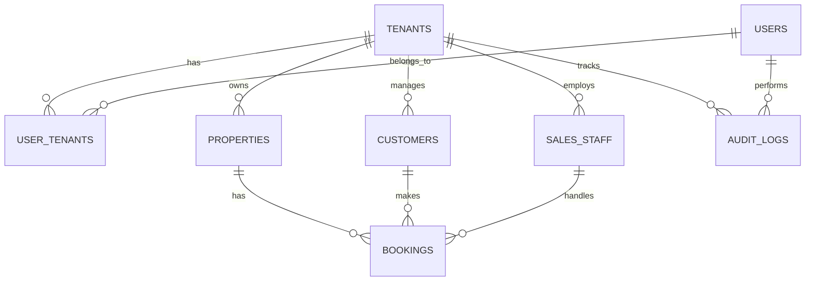

# Data Model: Production Readiness Enhancement

## Entity Relationship Diagram



## Core Entities

### 1. Tenants (Multi-tenant Companies)

**Purpose**: Represents each company/organization using the platform

```sql
CREATE TABLE tenants (
    id UUID DEFAULT gen_random_uuid() PRIMARY KEY,
    name TEXT NOT NULL,
    slug TEXT UNIQUE NOT NULL,
    domain TEXT UNIQUE,
    logo_url TEXT,
    theme_config JSONB DEFAULT '{}',
    subscription_plan TEXT NOT NULL DEFAULT 'standard',
    subscription_expires_at TIMESTAMPTZ,
    settings JSONB DEFAULT '{}',
    is_active BOOLEAN DEFAULT true,
    created_at TIMESTAMPTZ DEFAULT NOW(),
    updated_at TIMESTAMPTZ DEFAULT NOW()
);

-- Indexes
CREATE INDEX idx_tenants_slug ON tenants(slug);
CREATE INDEX idx_tenants_domain ON tenants(domain);
CREATE INDEX idx_tenants_active ON tenants(is_active);
```

**Key Fields**:
- `subscription_plan`: 'standard' | 'premium'
- `theme_config`: UI customizations (colors, logos)
- `settings`: Feature flags and configuration

### 2. Users (Platform Users)

**Purpose**: Individual user accounts with authentication

```sql
CREATE TABLE users (
    id UUID REFERENCES auth.users(id) ON DELETE CASCADE PRIMARY KEY,
    email TEXT UNIQUE NOT NULL,
    full_name TEXT,
    avatar_url TEXT,
    phone TEXT ENCRYPTED,
    is_active BOOLEAN DEFAULT true,
    last_login_at TIMESTAMPTZ,
    created_at TIMESTAMPTZ DEFAULT NOW(),
    updated_at TIMESTAMPTZ DEFAULT NOW()
);

-- Indexes
CREATE INDEX idx_users_email ON users(email);
CREATE INDEX idx_users_active ON users(is_active);
```

**Security Notes**:
- Phone number encrypted for PDPA compliance
- Direct link to Supabase auth.users table

### 3. User_Tenants (User-Company Relationships)

**Purpose**: Links users to tenant companies with roles

```sql
CREATE TABLE user_tenants (
    id UUID DEFAULT gen_random_uuid() PRIMARY KEY,
    user_id UUID REFERENCES users(id) ON DELETE CASCADE,
    tenant_id UUID REFERENCES tenants(id) ON DELETE CASCADE,
    role TEXT NOT NULL CHECK (role IN ('owner', 'admin', 'sales', 'viewer')),
    permissions JSONB DEFAULT '{}',
    is_active BOOLEAN DEFAULT true,
    created_at TIMESTAMPTZ DEFAULT NOW(),
    updated_at TIMESTAMPTZ DEFAULT NOW(),
    UNIQUE(user_id, tenant_id)
);

-- Indexes
CREATE INDEX idx_user_tenants_user ON user_tenants(user_id);
CREATE INDEX idx_user_tenants_tenant ON user_tenants(tenant_id);
CREATE INDEX idx_user_tenants_role ON user_tenants(role);
```

**Role Permissions**:
- `owner`: Full access to tenant settings
- `admin`: Manage users, properties, view reports
- `sales`: Manage assigned customers, create bookings
- `viewer`: Read-only access to dashboard

### 4. Categories (Property Categories)

**Purpose**: Property type classifications

```sql
CREATE TABLE categories (
    id UUID DEFAULT gen_random_uuid() PRIMARY KEY,
    tenant_id UUID REFERENCES tenants(id) ON DELETE CASCADE,
    name TEXT NOT NULL,
    description TEXT,
    icon_url TEXT,
    sort_order INTEGER DEFAULT 0,
    is_active BOOLEAN DEFAULT true,
    created_at TIMESTAMPTZ DEFAULT NOW(),
    updated_at TIMESTAMPTZ DEFAULT NOW(),
    UNIQUE(tenant_id, name)
);

-- Indexes
CREATE INDEX idx_categories_tenant ON categories(tenant_id);
CREATE INDEX idx_categories_active ON categories(is_active);
```

### 5. Projects (Real Estate Projects)

**Purpose**: Real estate development projects

```sql
CREATE TABLE projects (
    id UUID DEFAULT gen_random_uuid() PRIMARY KEY,
    tenant_id UUID REFERENCES tenants(id) ON DELETE CASCADE,
    category_id UUID REFERENCES categories(id),
    name TEXT NOT NULL,
    description TEXT,
    address TEXT NOT NULL,
    province TEXT NOT NULL,
    latitude DECIMAL(10, 8),
    longitude DECIMAL(11, 8),
    total_units INTEGER DEFAULT 0,
    images JSONB DEFAULT '[]',
    documents JSONB DEFAULT '[]',
    status TEXT DEFAULT 'active' CHECK (status IN ('active', 'inactive', 'completed')),
    created_at TIMESTAMPTZ DEFAULT NOW(),
    updated_at TIMESTAMPTZ DEFAULT NOW()
);

-- Indexes
CREATE INDEX idx_projects_tenant ON projects(tenant_id);
CREATE INDEX idx_projects_category ON projects(category_id);
CREATE INDEX idx_projects_status ON projects(status);
CREATE INDEX idx_projects_province ON projects(province);
```

### 6. Properties (Individual Units)

**Purpose**: Individual property units for sale/rent

```sql
CREATE TABLE properties (
    id UUID DEFAULT gen_random_uuid() PRIMARY KEY,
    tenant_id UUID REFERENCES tenants(id) ON DELETE CASCADE,
    project_id UUID REFERENCES projects(id),
    unit_number TEXT NOT NULL,
    title TEXT NOT NULL,
    description TEXT,
    property_type TEXT NOT NULL,
    bedrooms INTEGER,
    bathrooms INTEGER,
    area_sqm DECIMAL(10, 2),
    price DECIMAL(15, 2),
    status TEXT DEFAULT 'available' CHECK (status IN ('available', 'reserved', 'sold', 'rented')),
    images JSONB DEFAULT '[]',
    floor_plan JSONB,
    specifications JSONB DEFAULT '{}',
    pricing_history JSONB DEFAULT '[]',
    lock_expires_at TIMESTAMPTZ,
    locked_by UUID REFERENCES users(id),
    created_at TIMESTAMPTZ DEFAULT NOW(),
    updated_at TIMESTAMPTZ DEFAULT NOW(),
    UNIQUE(tenant_id, project_id, unit_number)
);

-- Indexes
CREATE INDEX idx_properties_tenant ON properties(tenant_id);
CREATE INDEX idx_properties_project ON properties(project_id);
CREATE INDEX idx_properties_status ON properties(status);
CREATE INDEX idx_properties_price ON properties(price);
CREATE INDEX idx_properties_lock ON properties(lock_expires_at) WHERE lock_expires_at IS NOT NULL;
```

**Concurrency Control**:
- `lock_expires_at`: 15-minute reservation window
- `locked_by`: User who reserved the unit
- Automatic cleanup via scheduled job

### 7. Customers (Potential Buyers)

**Purpose**: Customer leads and their information

```sql
CREATE TABLE customers (
    id UUID DEFAULT gen_random_uuid() PRIMARY KEY,
    tenant_id UUID REFERENCES tenants(id) ON DELETE CASCADE,
    assigned_sales_id UUID REFERENCES sales_staff(id),
    source TEXT NOT NULL DEFAULT 'walk_in', -- 'walk_in', 'web_form', 'line', 'referral'
    first_name TEXT NOT NULL,
    last_name TEXT NOT NULL,
    email TEXT,
    phone TEXT ENCRYPTED,
    id_number TEXT ENCRYPTED,
    address TEXT,
    purpose TEXT CHECK (purpose IN ('own_stay', 'investment', 'rental')),
    budget_min DECIMAL(15, 2),
    budget_max DECIMAL(15, 2),
    preferred_provinces TEXT[],
    notes TEXT,
    documents JSONB DEFAULT '[]',
    potential_score DECIMAL(3, 2) CHECK (potential_score >= 0 AND potential_score <= 100),
    financial_score DECIMAL(3, 2) CHECK (financial_score >= 0 AND financial_score <= 100),
    ai_analysis JSONB,
    status TEXT DEFAULT 'lead' CHECK (status IN ('lead', 'contacted', 'qualified', 'converted', 'lost')),
    last_contacted_at TIMESTAMPTZ,
    created_by UUID REFERENCES users(id),
    created_at TIMESTAMPTZ DEFAULT NOW(),
    updated_at TIMESTAMPTZ DEFAULT NOW()
);

-- Indexes
CREATE INDEX idx_customers_tenant ON customers(tenant_id);
CREATE INDEX idx_customers_sales ON customers(assigned_sales_id);
CREATE INDEX idx_customers_status ON customers(status);
CREATE INDEX idx_customers_source ON customers(source);
CREATE INDEX idx_customers_potential ON customers(potential_score);
CREATE INDEX idx_customers_financial ON customers(financial_score);
```

**AI Scoring**:
- `potential_score`: Likelihood to purchase (0-100)
- `financial_score`: Financial capability (0-100)
- `ai_analysis`: Detailed AI insights and recommendations

### 8. Sales_Staff (Sales Team Members)

**Purpose**: Sales personnel information

```sql
CREATE TABLE sales_staff (
    id UUID DEFAULT gen_random_uuid() PRIMARY KEY,
    tenant_id UUID REFERENCES tenants(id) ON DELETE CASCADE,
    user_id UUID REFERENCES users(id) ON DELETE CASCADE,
    employee_id TEXT UNIQUE,
    department TEXT,
    commission_rate DECIMAL(5, 2) DEFAULT 0.00,
    target_monthly DECIMAL(15, 2),
    is_active BOOLEAN DEFAULT true,
    hire_date DATE,
    created_at TIMESTAMPTZ DEFAULT NOW(),
    updated_at TIMESTAMPTZ DEFAULT NOW()
);

-- Indexes
CREATE INDEX idx_sales_staff_tenant ON sales_staff(tenant_id);
CREATE INDEX idx_sales_staff_user ON sales_staff(user_id);
CREATE INDEX idx_sales_staff_active ON sales_staff(is_active);
```

### 9. Bookings (Reservation Transactions)

**Purpose**: Property reservation and sale transactions

```sql
CREATE TABLE bookings (
    id UUID DEFAULT gen_random_uuid() PRIMARY KEY,
    tenant_id UUID REFERENCES tenants(id) ON DELETE CASCADE,
    property_id UUID REFERENCES properties(id),
    customer_id UUID REFERENCES customers(id),
    sales_staff_id UUID REFERENCES sales_staff(id),
    booking_number TEXT UNIQUE NOT NULL,
    type TEXT NOT NULL CHECK (type IN ('reservation', 'sale', 'rental')),
    status TEXT DEFAULT 'pending' CHECK (status IN ('pending', 'confirmed', 'cancelled', 'completed')),
    total_amount DECIMAL(15, 2),
    down_payment DECIMAL(15, 2),
    payment_schedule JSONB DEFAULT '[]',
    special_terms TEXT,
    documents JSONB DEFAULT '[]',
    notes TEXT,
    confirmed_at TIMESTAMPTZ,
    cancelled_at TIMESTAMPTZ,
    completed_at TIMESTAMPTZ,
    created_at TIMESTAMPTZ DEFAULT NOW(),
    updated_at TIMESTAMPTZ DEFAULT NOW()
);

-- Indexes
CREATE INDEX idx_bookings_tenant ON bookings(tenant_id);
CREATE INDEX idx_bookings_property ON bookings(property_id);
CREATE INDEX idx_bookings_customer ON bookings(customer_id);
CREATE INDEX idx_bookings_sales ON bookings(sales_staff_id);
CREATE INDEX idx_bookings_status ON bookings(status);
CREATE INDEX idx_bookings_number ON bookings(booking_number);
```

### 10. Marketing_Campaigns

**Purpose**: Marketing campaigns and customer targeting

```sql
CREATE TABLE marketing_campaigns (
    id UUID DEFAULT gen_random_uuid() PRIMARY KEY,
    tenant_id UUID REFERENCES tenants(id) ON DELETE CASCADE,
    name TEXT NOT NULL,
    description TEXT,
    type TEXT NOT NULL CHECK (type IN ('email', 'sms', 'line', 'social')),
    target_segments JSONB DEFAULT '[]',
    content JSONB NOT NULL,
    scheduled_at TIMESTAMPTZ,
    sent_at TIMESTAMPTZ,
    status TEXT DEFAULT 'draft' CHECK (status IN ('draft', 'scheduled', 'sending', 'sent', 'paused')),
    metrics JSONB DEFAULT '{}',
    created_by UUID REFERENCES users(id),
    created_at TIMESTAMPTZ DEFAULT NOW(),
    updated_at TIMESTAMPTZ DEFAULT NOW()
);

-- Indexes
CREATE INDEX idx_campaigns_tenant ON marketing_campaigns(tenant_id);
CREATE INDEX idx_campaigns_status ON marketing_campaigns(status);
CREATE INDEX idx_campaigns_scheduled ON marketing_campaigns(scheduled_at);
```

### 11. Audit_Logs

**Purpose**: Immutable audit trail for compliance

```sql
CREATE TABLE audit_logs (
    id UUID DEFAULT gen_random_uuid() PRIMARY KEY,
    tenant_id UUID REFERENCES tenants(id) ON DELETE CASCADE,
    user_id UUID REFERENCES users(id),
    action TEXT NOT NULL,
    table_name TEXT NOT NULL,
    record_id UUID,
    old_values JSONB,
    new_values JSONB,
    ip_address INET,
    user_agent TEXT,
    created_at TIMESTAMPTZ DEFAULT NOW()
);

-- Indexes
CREATE INDEX idx_audit_logs_tenant ON audit_logs(tenant_id);
CREATE INDEX idx_audit_logs_user ON audit_logs(user_id);
CREATE INDEX idx_audit_logs_table ON audit_logs(table_name);
CREATE INDEX idx_audit_logs_created ON audit_logs(created_at);

-- Partition by month for performance
CREATE TABLE audit_logs_y2024m01 PARTITION OF audit_logs
FOR VALUES FROM ('2024-01-01') TO ('2024-02-01');
```

## Row Level Security (RLS) Policies

### Tenant Isolation Policies

```sql
-- Tenants: Only owners can see their tenant
CREATE POLICY "Tenant owners can view their tenant" ON tenants
FOR SELECT USING (
    id IN (
        SELECT tenant_id FROM user_tenants
        WHERE user_id = auth.uid() AND role = 'owner'
    )
);

-- All tables: Users can only access their tenant's data
CREATE POLICY "Users can access their tenant data" ON properties
FOR ALL USING (
    tenant_id IN (
        SELECT tenant_id FROM user_tenants
        WHERE user_id = auth.uid() AND is_active = true
    )
);

-- Similar policies for all tenant-scoped tables
```

### Role-Based Access Policies

```sql
-- Properties: Different access by role
CREATE POLICY "Admins can manage all properties" ON properties
FOR ALL USING (
    tenant_id IN (
        SELECT tenant_id FROM user_tenants
        WHERE user_id = auth.uid() AND role IN ('owner', 'admin')
    )
);

CREATE POLICY "Sales can view and lock properties" ON properties
FOR SELECT USING (
    tenant_id IN (
        SELECT tenant_id FROM user_tenants
        WHERE user_id = auth.uid() AND role = 'sales'
    )
);

CREATE POLICY "Sales can update property locks" ON properties
FOR UPDATE USING (
    tenant_id IN (
        SELECT tenant_id FROM user_tenants
        WHERE user_id = auth.uid() AND role = 'sales'
    )
) WITH CHECK (
    jsonb_extract_path_text(new, 'status') = 'reserved' AND
    new.locked_by = auth.uid()
);
```

## Data Validation Rules

### Email and Phone Validation
```sql
-- Email format check
ALTER TABLE users ADD CONSTRAINT valid_email
CHECK (email ~* '^[A-Za-z0-9._%+-]+@[A-Za-z0-9.-]+\.[A-Za-z]{2,}$');

-- Phone format (Thai numbers)
ALTER TABLE customers ADD CONSTRAINT valid_phone
CHECK (phone ~* '^(\+66|0)[0-9]{9}$');
```

### Financial Data Validation
```sql
-- Price and budget constraints
ALTER TABLE properties ADD CONSTRAINT positive_price
CHECK (price > 0);

ALTER TABLE customers ADD CONSTRAINT logical_budget
CHECK (budget_max IS NULL OR budget_min IS NULL OR budget_max >= budget_min);
```

## Performance Optimizations

### Indexes
- Composite indexes for common queries
- Partial indexes for filtered data
- JSONB GIN indexes for document search

### Partitioning
- Audit logs partitioned by month
- Consider partitioning large tables by tenant_id

### Materialized Views
```sql
CREATE MATERIALIZED VIEW dashboard_stats AS
SELECT
    tenant_id,
    COUNT(DISTINCT id) as total_properties,
    COUNT(DISTINCT id) FILTER (WHERE status = 'available') as available_properties,
    COUNT(DISTINCT id) FILTER (WHERE status = 'sold') as sold_properties,
    SUM(price) FILTER (WHERE status = 'sold') as total_sales_value,
    AVG(price) as avg_property_price
FROM properties
GROUP BY tenant_id;

-- Refresh hourly
CREATE OR REPLACE FUNCTION refresh_dashboard_stats()
RETURNS void AS $$
BEGIN
    REFRESH MATERIALIZED VIEW CONCURRENTLY dashboard_stats;
END;
$$ LANGUAGE plpgsql;

SELECT cron.schedule('refresh-dashboard-stats', '0 * * * *', 'SELECT refresh_dashboard_stats();');
```

## Data Migration Strategy

### Phase 1: Schema Creation
1. Create all tables with proper constraints
2. Set up RLS policies
3. Create indexes and materialized views

### Phase 2: Data Import
1. Export existing prototype data
2. Transform to new schema format
3. Import with tenant_id assignment
4. Validate data integrity

### Phase 3: API Integration
1. Update Supabase client configuration
2. Implement tenant context in API calls
3. Add audit logging triggers

## TypeScript Types

```typescript
// Generated via Supabase CLI
export type Database = {
  public: {
    Tables: {
      tenants: { Row: {...}; Insert: {...}; Update: {...} }
      users: { Row: {...}; Insert: {...}; Update: {...} }
      // ... other tables
    }
  }
}

// Custom types for business logic
export type TenantUser = {
  user: Database['public']['Tables']['users']['Row']
  tenant: Database['public']['Tables']['tenants']['Row']
  role: 'owner' | 'admin' | 'sales' | 'viewer'
  permissions: Record<string, boolean>
}
```

## GDPR/PDPA Compliance Features

### Data Anonymization
- Automatic pseudonymization after retention period
- Right to be forgotten implementation
- Data export functionality

### Consent Management
```sql
CREATE TABLE consent_records (
    id UUID DEFAULT gen_random_uuid() PRIMARY KEY,
    user_id UUID REFERENCES users(id),
    purpose TEXT NOT NULL,
    status TEXT NOT NULL CHECK (status IN ('active', 'withdrawn')),
    granted_at TIMESTAMPTZ DEFAULT NOW(),
    withdrawn_at TIMESTAMPTZ,
    ip_address INET,
    user_agent TEXT
);
```

### Data Retention
- Configurable retention periods per data type
- Automated cleanup jobs
- Legal hold for ongoing investigations