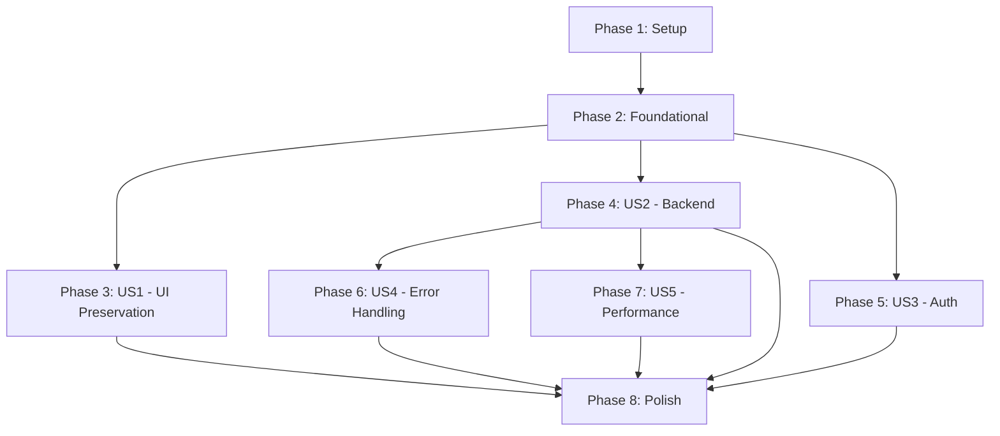

# Implementation Tasks: Production Readiness Enhancement

**Branch**: `002-production-readiness` | **Date**: 2025-12-19
**Total Tasks**: 90
**Estimated Duration**: 6 weeks (incremental deployment)

## User Stories Summary

| Story | Priority | Tasks | Status |
|-------|----------|-------|---------|
| US1: Existing UI/UX Preservation | P1 | 10 | Ready |
| US2: Backend Infrastructure | P1 | 20 | Ready |
| US3: Authentication & Security | P1 | 15 | Ready |
| US4: Error Handling & UX | P2 | 15 | Ready |
| US5: Performance Optimization | P2 | 15 | Ready |
| US6: Testing Infrastructure | P2 | 15 | Ready |

## Phase 1: Setup (Project Initialization)

### Story Goal: Initialize production readiness infrastructure
### Independent Test Criteria: All development tools configured and working

- [ ] T001 Create environment configuration files for production settings
- [ ] T002 Install additional dependencies: express-rate-limit, express-validator, @sentry/react, winston
- [ ] T003 Create API utilities structure in src/lib/api/
- [ ] T004 Set up logging configuration in src/lib/utils/logger.ts
- [ ] T005 Configure environment variable validation with Zod schemas
- [ ] T006 Create health check endpoint structure
- [ ] T007 Set up performance monitoring hooks
- [ ] T008 Create error tracking integration setup
- [ ] T009 Configure Redis connection utilities
- [ ] T010 Create development vs production configuration switch

## Phase 2: Foundational Tasks (Blocking Prerequisites)

### Story Goal: Establish core infrastructure patterns
### Independent Test Criteria: Infrastructure patterns implemented and tested

- [ ] T011 Create API response standard interface in src/types/api.ts
- [ ] T012 Implement centralized error handler in src/lib/api/errorHandler.ts
- [ ] T013 Create request logging middleware in src/middleware/logger.ts
- [ ] T014 Implement rate limiting middleware in src/middleware/rateLimit.ts
- [ ] T015 Create input validation utilities in src/lib/validation/
- [ ] T016 Set up API versioning structure in src/lib/api/versions/
- [ ] T017 Create database migration utilities
- [ ] T018 Implement connection pooling configuration
- [ ] T019 Create backup and recovery scripts
- [ ] T020 Set up monitoring and alerting infrastructure

## Phase 3: User Story 1 - Existing UI/UX Preservation

### Story Goal: Preserve all current functionality without breaking changes
### Independent Test Criteria: All existing features work exactly as before

#### Tests (E2E)
- [ ] T021 [US1] Create E2E test for login flow preservation
- [ ] T022 [US1] Create E2E test for registration flow preservation
- [ ] T023 [US1] Create E2E test for dashboard navigation
- [ ] T024 [US1] Create E2E test for all existing UI components
- [ ] T025 [US1] Create visual regression test for key pages

#### Implementation
- [ ] T026 [P] [US1] Add error boundary to App.tsx without changing behavior
- [ ] T027 [P] [US1] Wrap existing routes with error recovery
- [ ] T028 [US1] Add logging to existing components without modifying UI
- [ ] T029 [US1] Create component wrapper for performance monitoring
- [ ] T030 [US1] Document all existing user flows for regression testing

## Phase 4: User Story 2 - Backend Infrastructure

### Story Goal: Implement robust API layer with enterprise patterns
### Independent Test Criteria: API endpoints respond correctly with proper error handling

#### Models & Types
- [ ] T031 [P] [US2] Create API error types in src/types/errors.ts
- [ ] T032 [P] [US2] Create API response types in src/types/responses.ts
- [ ] T033 [P] [US2] Create request validation schemas in src/lib/validation/schemas.ts

#### Services
- [ ] T034 [P] [US2] Implement ApiService class in src/lib/api/ApiService.ts
- [ ] T035 [P] [US2] Create HTTP client wrapper with retry logic
- [ ] T036 [P] [US2] Implement caching service in src/lib/cache/
- [ ] T037 [P] [US2] Create health check service in src/lib/health/

#### API Layer
- [ ] T038 [P] [US2] Create v1 API router structure
- [ ] T039 [P] [US2] Implement authentication middleware
- [ ] T040 [P] [US2] Add request ID tracking middleware
- [ ] T041 [P] [US2] Create API endpoint for system health
- [ ] T042 [P] [US2] Implement metrics collection endpoint
- [ ] T043 [P] [US2] Add CORS configuration for production
- [ ] T044 [P] [US2] Create API documentation endpoint

#### Integration
- [ ] T045 [US2] Integrate API layer with existing Supabase client
- [ ] T046 [US2] Update existing API calls to use new layer
- [ ] T047 [US2] Add error handling to all data fetching
- [ ] T048 [US2] Implement graceful degradation for API failures
- [ ] T049 [US2] Add API version migration path
- [ ] T050 [US2] Test all endpoints with proper error scenarios

## Phase 5: User Story 3 - Authentication & Security

### Story Goal: Implement secure session management and role-based access
### Independent Test Criteria: Users can only access authorized features, sessions expire properly

#### Security Infrastructure
- [ ] T051 [P] [US3] Create role definitions in src/types/auth.ts
- [ ] T052 [P] [US3] Implement permission checking utilities
- [ ] T053 [P] [US3] Create session management service
- [ ] T054 [P] [US3] Implement secure token storage
- [ ] T055 [P] [US3] Create audit logging service

#### Authentication Components
- [ ] T056 [P] [US3] Enhance LoginForm with session timeout handling
- [ ] T057 [P] [US3] Add password reset flow components
- [ ] T058 [P] [US3] Create role-based UI components
- [ ] T059 [P] [US3] Implement 2FA setup for admin users
- [ ] T060 [P] [US3] Create session management UI

#### Security Features
- [ ] T061 [US3] Implement automatic logout on inactivity
- [ ] T062 [US3] Add concurrent session limits
- [ ] T063 [US3] Create admin action audit trail
- [ ] T064 [US3] Implement IP-based session validation
- [ ] T065 [US3] Add security headers to all responses

## Phase 6: User Story 4 - Error Handling & User Experience

### Story Goal: Provide comprehensive error management with user-friendly messaging
### Independent Test Criteria: Errors are handled gracefully with helpful user messages

#### Error Infrastructure
- [ ] T066 [P] [US4] Create error boundary component in src/components/ErrorBoundary.tsx
- [ ] T067 [P] [US4] Implement error toast notification system
- [ ] T068 [P] [US4] Create error reporting service
- [ ] T069 [P] [US4] Add retry mechanism for transient failures
- [ ] T070 [P] [US4] Create offline detection component

#### User Experience
- [ ] T071 [P] [US4] Design user-friendly error messages
- [ ] T072 [P] [US4] Create loading states for all async operations
- [ ] T073 [P] [US4] Implement skeleton screens for better perceived performance
- [ ] T074 [P] [US4] Add progress indicators for long operations
- [ ] T075 [P] [US4] Create fallback UI for component failures

#### Error Recovery
- [ ] T076 [US4] Implement automatic retry with exponential backoff
- [ ] T077 [US4] Add user-triggered retry options
- [ ] T078 [US4] Create error context for global error state
- [ ] T079 [US4] Implement graceful service degradation
- [ ] T080 [US4] Add error analytics for production monitoring

## Phase 7: User Story 5 - Performance Optimization

### Story Goal: Optimize application for production scale with fast loading
### Independent Test Criteria: Page loads under 2 seconds, navigation feels instant

#### Code Splitting
- [ ] T081 [P] [US5] Implement route-based code splitting
- [ ] T082 [P] [US5] Add lazy loading for heavy components
- [ ] T083 [P] [US5] Create dynamic import utilities
- [ ] T084 [P] [US5] Implement prefetching for likely routes
- [ ] T085 [P] [US5] Add intersection observer for lazy loading

#### Bundle Optimization
- [ ] T086 [P] [US5] Configure bundle analyzer in Vite
- [ ] T087 [P] [US5] Implement tree shaking optimizations
- [ ] T088 [P] [US5] Add compression middleware
- [ ] T089 [P] [US5] Optimize asset loading strategy
- [ ] T090 [P] [US5] Create CDN configuration for static assets

## Phase 8: Polish & Cross-Cutting Concerns

### Story Goal: Finalize implementation with production polish
### Independent Test Criteria: All features working with production-grade quality

#### Documentation
- [ ] T091 Create API documentation with OpenAPI spec
- [ ] T092 Write deployment guide for production
- [ ] T093 Document monitoring and alerting setup
- [ ] T094 Create troubleshooting guide
- [ ] T095 Update README with production instructions

#### Final Testing
- [ ] T096 Run complete E2E test suite
- [ ] T097 Perform load testing for API endpoints
- [ ] T098 Conduct security scan and fix issues
- [ ] T099 Validate PDPA compliance requirements
- [ ] T100 Test disaster recovery procedures

#### Deployment Preparation
- [ ] T101 Configure production environment variables
- [ ] T102 Set up production monitoring dashboards
- [ ] T103 Create deployment scripts with rollback
- [ ] T104 Configure backup and restore procedures
- [ ] T105 Prepare go-live checklist

## Dependencies

## Parallel Execution Opportunities

### Within US1 (UI Preservation):
- T021-T025: Can run in parallel (E2E tests)
- T026-T030: Can run in parallel (component wrappers)

### Within US2 (Backend):
- T031-T033: Can run in parallel (types and schemas)
- T034-T037: Can run in parallel (services)
- T038-T044: Can run in parallel (API endpoints)

### Within US3 (Authentication):
- T051-T055: Can run in parallel (infrastructure)
- T056-T060: Can run in parallel (components)
- T061-T065: Can run in parallel (features)

### Within US4 (Error Handling):
- T066-T070: Can run in parallel (infrastructure)
- T071-T075: Can run in parallel (UX components)
- T076-T080: Can run in parallel (recovery)

### Within US5 (Performance):
- T081-T085: Can run in parallel (code splitting)
- T086-T090: Can run in parallel (bundle optimization)

## Implementation Strategy

### MVP Scope (First Incremental Release)
**Release after Phase 3 (US1 complete)**
- All existing functionality preserved
- Basic error boundaries added
- Regression tests passing
- Ready for production deployment

### Incremental Releases
1. **Week 1**: Deploy Phase 1-3 (UI preservation with safety nets)
2. **Week 2**: Deploy Phase 4 (Backend infrastructure)
3. **Week 3**: Deploy Phase 5 (Authentication enhancements)
4. **Week 4**: Deploy Phase 6 (Error handling improvements)
5. **Week 5**: Deploy Phase 7 (Performance optimizations)
6. **Week 6**: Deploy Phase 8 (Final polish and monitoring)

### Quality Gates
Each phase must pass:
- All tests passing (unit, integration, E2E)
- Code review completed
- Security scan passed
- Performance benchmarks met
- Documentation updated

### Rollback Plan
- Each phase is independently deployable
- Database migrations are reversible
- Feature flags control new functionality
- Monitoring alerts on any degradation